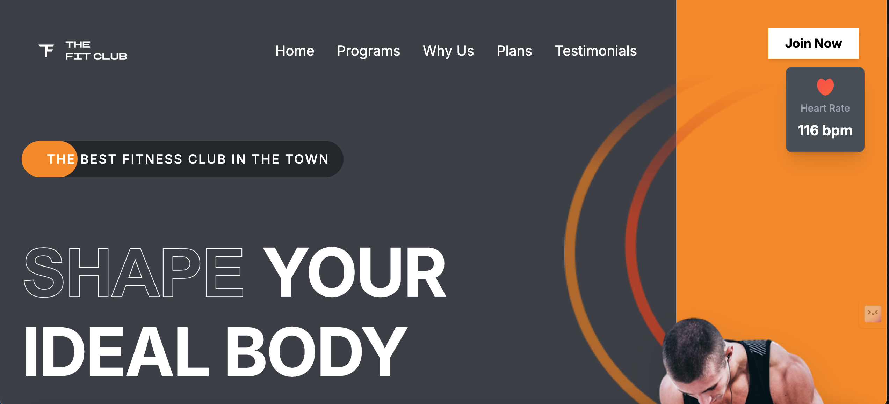
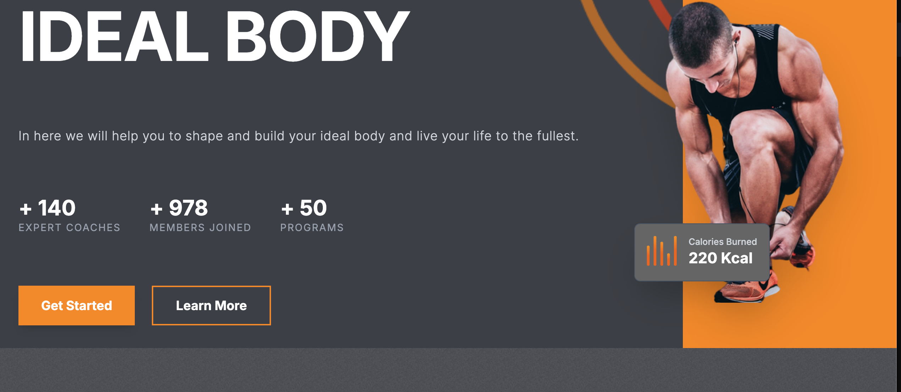
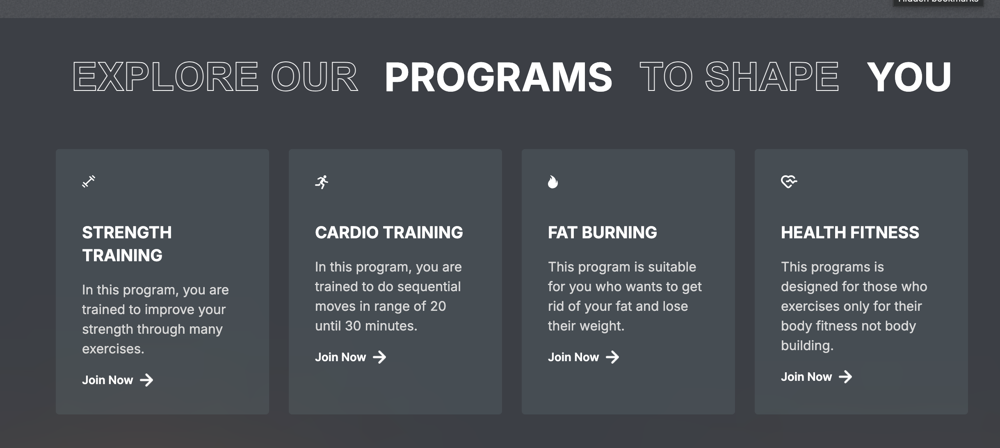
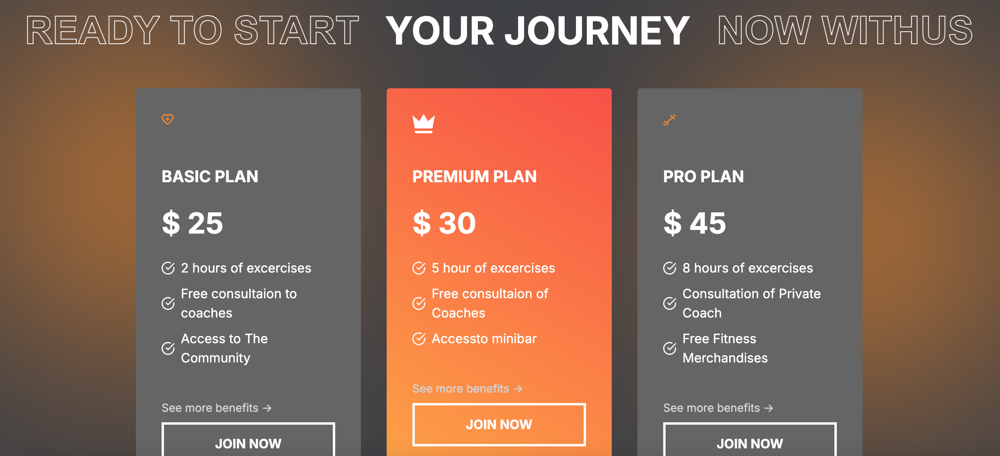
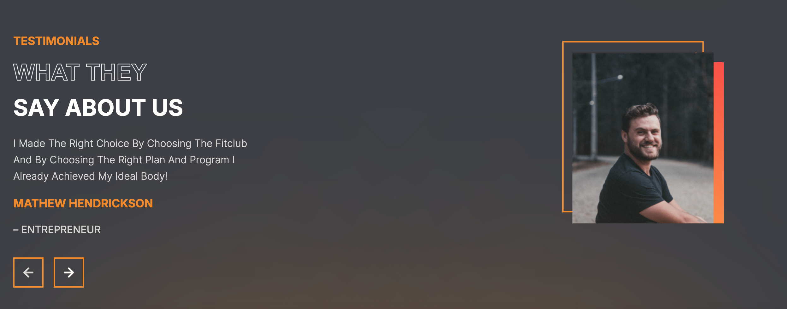
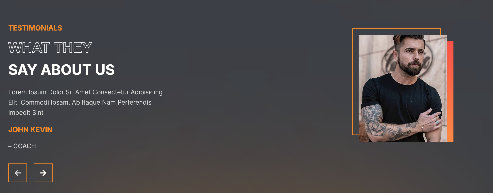

# Modern Gym Website 🏋️‍♂️

A premium, high-performance fitness club website built with **React** and **Vite**. This project features a modern UI with smooth transitions, detailed training programs, membership plans, and real-time heart rate/calories visualizations.

## 🚀 What I Did
- **Project Structure**: Set up a scalable React project using Vite for lightning-fast development.
- **Modern UI**: Implemented a "Senior Developer" grade design with custom CSS variables and Tailwind CSS.
- **Responsive Layout**: Designed the interface to be responsive across mobile, tablet, and desktop views.
- **Dynamic Content**: Built modular sections for Hero, Programs, Plans, and Testimonials using dynamic data mapping.
- **Asset Integration**: Optimized and integrated high-quality assets including SVG icons and crisp PNG images.
- **Performance Fixes**: Resolved Vite build errors, refactored imports for stability, and optimized the component architecture.

## 🛠️ Technology Stack
- **Frontend**: React.js
- **Build Tool**: Vite
- **Styling**: Tailwind CSS & Vanilla CSS
- **Programming Language**: JavaScript (ES6+)
- **Design Patterns**: Component-based Architecture, Props-driven Data Flow

## 📸 Screenshots
| | |
|:---:|:---:|
|  |  |
|  |  |
|  |  |

## 💻 How To Run
1. Clone the repository
2. Navigate to the project directory:
   ```bash
   cd Gym-Website
   ```
3. Install dependencies:
   ```bash
   npm install
   ```
4. Start the development server:
   ```bash
   npm run dev
   ```

## 📬 Contact Me
- **Email**: [muhammadzohaib1090@gmail.com](mailto:muhammadzohaib1090@gmail.com)
- **LinkedIn**: [muhammadzohaib](https://www.linkedin.com/in/muhamadzohaib/)

---
*Developed with focus on performance and aesthetics.*
